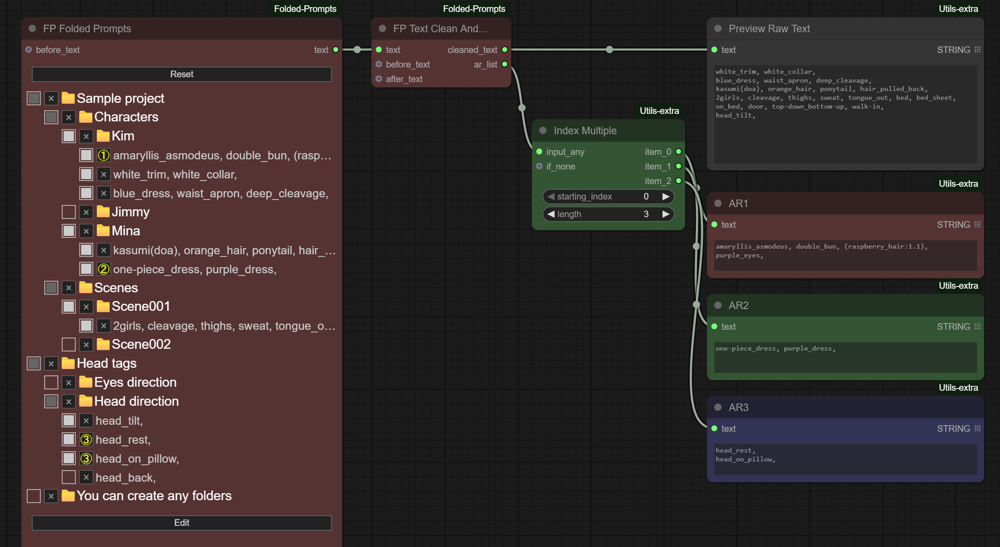
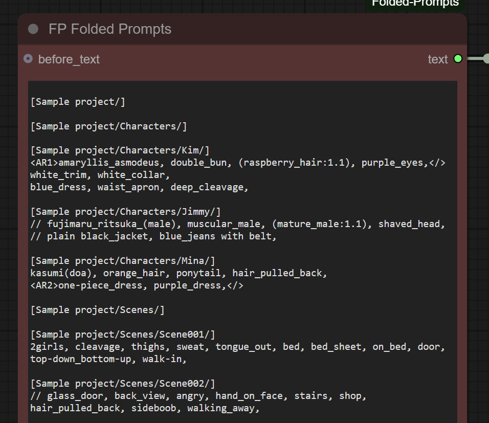
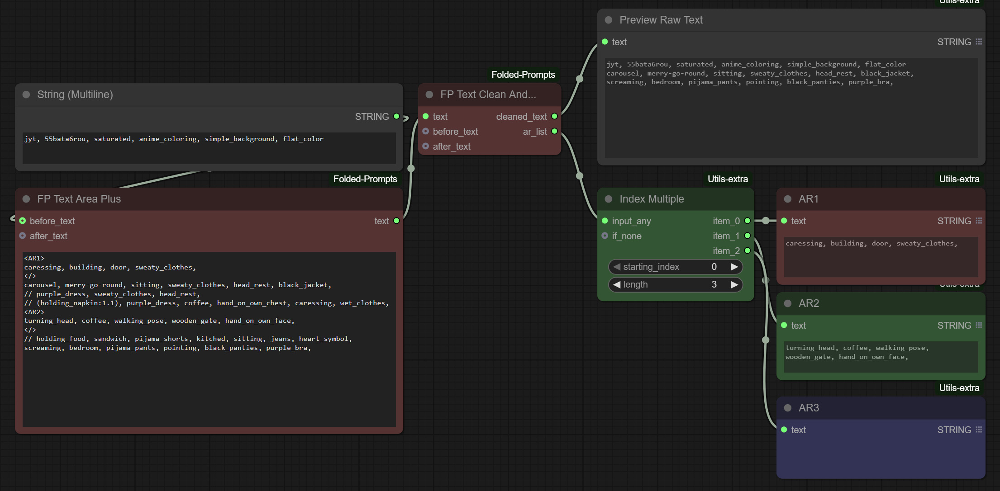

## Other My Nodes

### Utilities for working with Lists and toggling groups
https://github.com/akawana/ComfyUI-Utils-extra

### Extra shortcuts for editing texts and prompts + text splitting for Regional Prompts
https://github.com/akawana/ComfyUI-Keybinding-extra

### RGBYP 5-color mask editor
https://github.com/akawana/ComfyUI-RGBYP-Mask-Editor

---

# Keybinding Extra

A minimal ComfyUI extension that adds several quality-of-life tools:

- Injects handy keyboard shortcuts into the ComfyUI frontend  
- Adds a utility node **Text Cleaner & Splitter** (v1.02) for text preprocessing

In ComfyUI Settings you can enable/disable shortcuts and customize their behavior.  
The utility node can clean text, remove comments, and extract regional prompt tags.

---

## Features (v1.04)

This extension now provides **3 keyboard shortcuts** and **1 utility node**:

1. **Toggle line comment — `Ctrl + /`**
2. **Delete line — `Ctrl + Shift + L`**
3. **Move tag (word) under cursor down and comment it — `Ctrl + Shift + /`**
4. Node: **Text Cleaner & Splitter node** (in utils/primitive category)

---

## Keyboard Shortcuts

### 1. Toggle line comment — `Ctrl + /`

Works in all ComfyUI text editors/areas:

- Ace  
- CodeMirror  
- Plain textarea inputs  

**Behavior**
- Press `Ctrl + /` to comment/uncomment the current line or selected lines.
- By default it uses `// ` (with a space).
- If a line already starts with `//` or `// `, the shortcut removes it.

---

### Configurable comment prefix

In **ComfyUI → Settings → Keybinding Extra** you can set any prefix you want, for example:

- `//`
- `#`
- `--`
- `;`

There is also an enable/disable toggle for the comment shortcut.

---

### 2. Delete line — `Ctrl + Shift + L`

Works in the same editors/areas:

- Ace  
- CodeMirror  
- Plain textarea inputs  

**Behavior**
- Press `Ctrl + Shift + L` to delete the current line.
- If multiple lines are selected, deletes all selected lines.
- Deletion supports editor undo (`Ctrl + Z`) where possible.

---

### 3. Move & Comment word(tag) or selection — `Ctrl + Shift + /`

Works in the same editors/areas:

- Ace  
- CodeMirror  
- Plain textarea inputs  

**Behavior**
- Press `Ctrl + Shift + /` to cut the word under the cursor (or all selected words).
- Removes the word(s) from anywhere in the line.
- Inserts them on the next new line.
- Comments the moved word(s) on new line using the comment prefix set in the extension settings.
- Supports editor undo (`Ctrl + Z`) (I know about whole text selection).

---

## FP Folded Prompt

Builds a **folder-based tree** from your prompt lines.  
Useful for large projects where you need to store many previous prompts, reuse prompt blocks, or quickly insert sets of tags without typing them manually.

The node saves JSON representations of your trees in `/input/prompts_folded/`.  
This folder is optional — you may delete it at any time. All data is still stored in the workflow itself.



### Modes

#### 1. Tree Mode

- Visual folder tree  
- Enable/disable lines  
- Assign Regional Prompting areas  
- Edit everything using the mouse  

#### 2. Edit Mode

Write your structure manually using `[Folder]` syntax:

```text
[Folder]
string1 some text or tags, bla, bla, bla
string2 some text or tags, bla, bla, bla

[Folder/Subfolder]
string1 some text or tags, bla, bla, bla
string2 some text or tags, bla, bla, bla

[Folder/Subfolder/SubSubfolder]
string1 some text or tags, bla, bla, bla
string2 some text or tags, bla, bla, bla
```

### Commenting

Use `//` at the start of a line:

```text
string1 normal line
// string2 commented line
```

Commented lines appear disabled in the tree.

### Regional Prompting Support

You may assign any line to one of **five** AR regions using HTML-like tags:

```text
<AR1>text...</>
<AR2>text...</>
<AR3>text...</>
<AR4>text...</>
<AR5>text...</>
```

**Important:** The closing tag is always `</>`.  
This makes editing large texts easier — no need to rename closing tags.

All AR features can also be controlled visually in Tree Mode.



---

## FP Text Clean And Split

Utility node that processes raw text (either from FP Folded Prompt or from any normal text input).

### Behavior

- Removes commented lines (`// ...`)
- Detects AR blocks (`<AR1>...</>`, … `<AR5>...</>`)
- Extracts AR blocks and outputs them as a **list** on `ar_list`
- Removes AR blocks from the main text and outputs the cleaned version

### Why this is useful

You can:

- quickly compose prompts by hand  
- comment out what you don't need  
- use Regional Prompting without manually parsing anything  



---

## FP Text Area Plus

Simple utility text node.

### Features

- Standard text input field  
- Optional *before text* field  
- Optional *after text* field  
- Outputs the concatenated full result  

## Installation

You can install this extension in two ways:

### 1. Through ComfyUI Manager (recommended)

Open **ComfyUI Manager → Install**,  
then simply search for **Folded prompts** in the search bar.  
Select the extension and click **Install**.

### 2. Manual installation

```bash
cd ComfyUI/custom_nodes
git clone https://github.com/akawana/ComfyUI-Folded-Prompts.git

